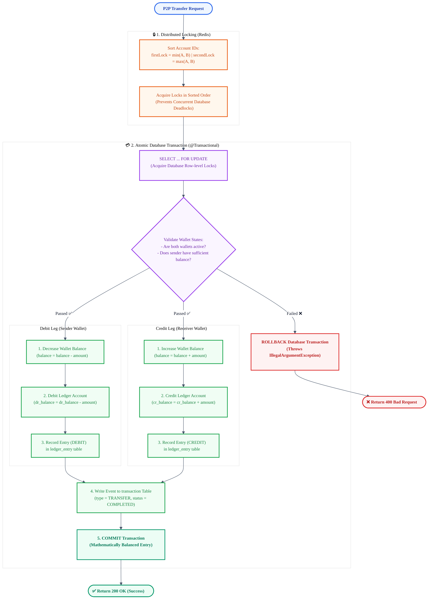
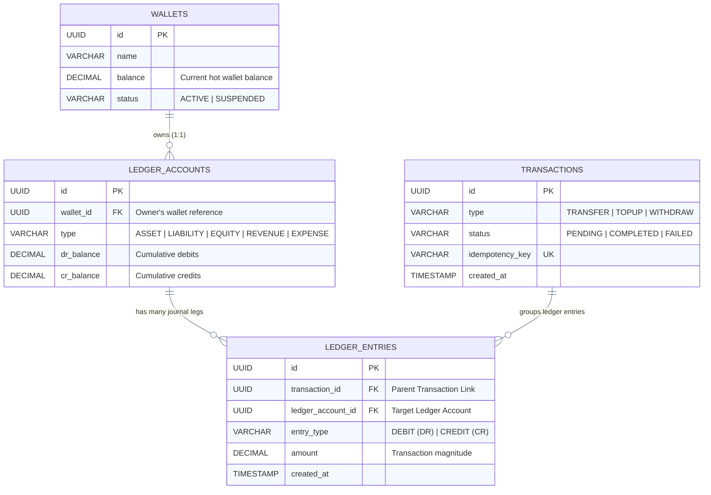
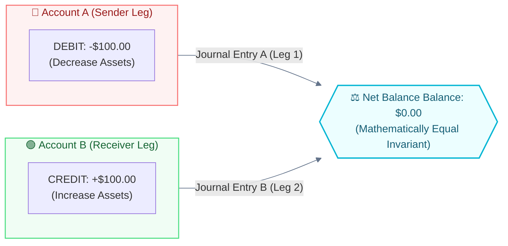

# 🏦 J-Ledger Double-Entry Core Engine Flow

> **กระบวนการทำงานของ Double-Entry Financial Ledger Engine (Spring Boot & PostgreSQL)**
> เอกสารนี้เตรียมไว้สำหรับการแคปเจอร์หน้าจอ (Screenshot) เพื่อใช้เป็นภาพประกอบ `2_core.png` บนหน้า Portfolio

---

## 📐 1. Double-Entry Flowchart & Database Balancing Invariant

แผนภูมิกระบวนการโอนเงินและกลไกบัญชีแยกประเภทแบบคู่ เพื่อรักษาความถูกต้องของยอดเงินรวมในระบบแบบ Atomic Transaction

---

## 📊 2. Double-Entry Accounting Journal Matching (PostgreSQL Schema)

การจำลองโครงสร้างข้อมูลและบันทึก Journal Entry เมื่อเกิดรายการโอนเงิน $100.00 จาก Wallet A ไปยัง Wallet B

---

## 📊 3. Journal Entry Balance Ledger State (Example Ledger Match)

เมื่อโอนเงิน **$100.00** จากบัญชี A ไปยังบัญชี B:
* **Debit Account A** (ลดสินทรัพย์): -$100.00 (DEBIT)
* **Credit Account B** (เพิ่มสินทรัพย์): +$100.00 (CREDIT)
* **สมการดุลยภาพทางคณิตศาสตร์**: $\sum \text{Debit} = \sum \text{Credit} = \$100.00$ (ยอดดุลคงที่เสมอ)

