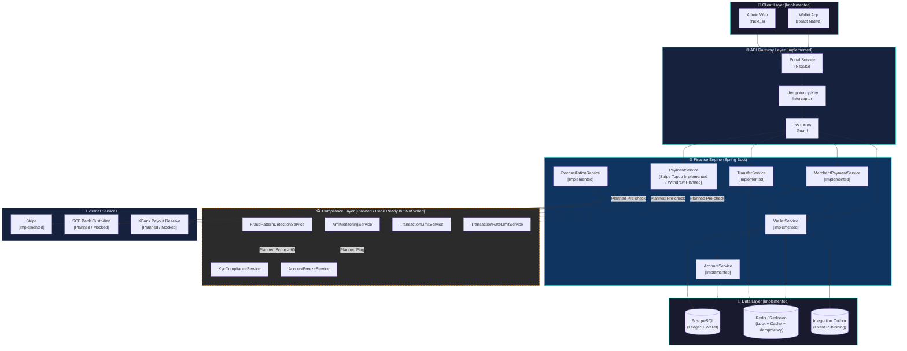
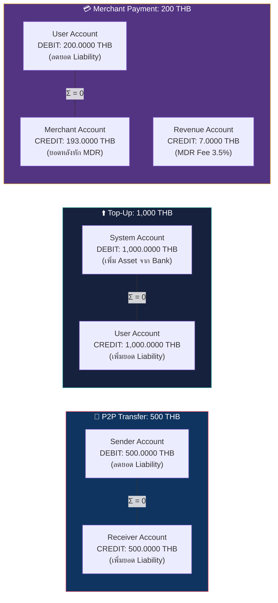
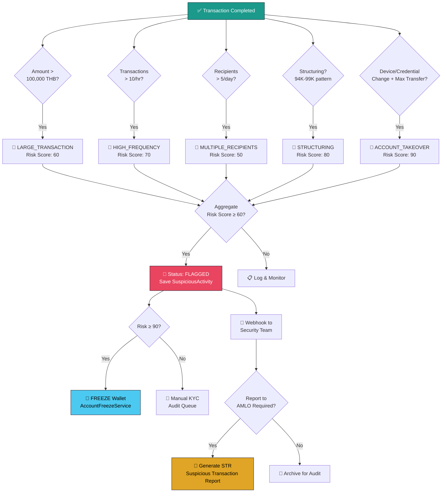
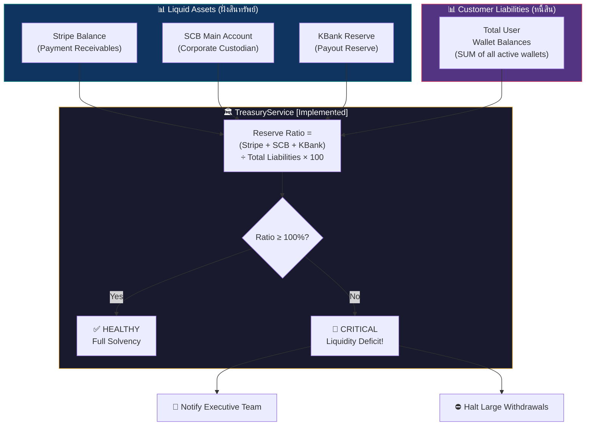

# J-Ledger System Architecture & Flow Diagrams 🏦

> เอกสารจำลองกระบวนการโอนเงินระหว่างบัญชีผู้ใช้ และโฟลว์การหักลบยอดเงินที่ปลอดภัยของระบบ J-Ledger
> **[อัปเดตสถานะการพัฒนา: Implemented vs Planned]**

---

## 🎨 สัญลักษณ์สีในโครงสร้างระบบ (Legend)
*   🟢 **Implemented (ใช้งานได้จริงแล้ว):** มีการเชื่อมต่อระบบเข้ากันอย่างสมบูรณ์ในโปรดักชัน
*   🟡 **Planned / Code Ready but Not Wired (พร้อมพัฒนาต่อ):** มีการเขียนโค้ดและ Unit Test ใน Service เรียบร้อยแล้ว แต่ยังไม่ได้เปิดใช้งานหรือดึงเข้าไปเชื่อมต่อในกระบวนการธุรกรรมหลัก

---

## 📐 1. System Architecture Overview (High-Level)

ภาพรวมสถาปัตยกรรมทั้งหมดของระบบ J-Ledger ตั้งแต่ Client → API Gateway → Core Services → Data Layer

---

## 🔄 2. P2P Transfer Flow (โอนเงินระหว่างผู้ใช้)

กระบวนการโอนเงินระหว่างบัญชีผู้ใช้ทั้งหมด ตั้งแต่ Client ส่ง Request จนถึงยืนยันผล (แสดงส่วนเชื่อมต่อแบบ Real-Time และแบบ Planned)

```mermaid
sequenceDiagram
    autonumber
    participant C as 📱 Client [Implemented]
    participant GW as 🌐 Portal Gateway [Implemented]
    participant R as 🔴 Redis [Implemented]
    participant TS as ⚙️ TransferService [Implemented]
    participant WS as 💰 WalletService [Implemented]
    participant DB as 💾 PostgreSQL [Implemented]
    participant AML as 🕵️ AML Monitor [Planned / Code Ready]
    participant OB as 📤 Outbox [Implemented]

    C->>GW: POST /api/v1/transfers<br/>(Idempotency-Key: UUID)
    GW->>GW: JWT Authentication & Validation
    GW->>TS: executeTransfer(idempotencyKey, request)

    Note over TS: 📋 Step 1: Idempotency Check
    TS->>R: getIfProcessed(idempotencyKey)
    alt ✅ Already Processed
        R-->>TS: Cached Transaction
        TS-->>C: 200 OK (Cached Response)
    else ❌ Not Yet Processed
        R-->>TS: Empty (Lock Acquired)

        Note over TS: 🔒 Step 2: Deadlock-Free Locking
        TS->>TS: Sort Account IDs Lexicographically<br/>firstId = min(fromId, toId)<br/>secondId = max(fromId, toId)
        TS->>R: tryLock(account_lock:firstId, 3s wait, 10s lease)
        R-->>TS: Lock Acquired ✅
        TS->>R: tryLock(account_lock:secondId, 3s wait, 10s lease)
        R-->>TS: Lock Acquired ✅

        Note over TS: 💸 Step 3: Execute Transfer
        TS->>WS: transferByWalletId(from, to, amount, metadata)

        Note over WS,DB: 🔐 @Transactional Boundary Begins
        WS->>DB: SELECT ... FOR UPDATE (Wallet: fromId)
        WS->>DB: SELECT ... FOR UPDATE (Wallet: toId)
        WS->>WS: Validate: isActive? balance ≥ amount?

        Note over WS: 📉 Step 4: Balance Mutations
        WS->>DB: UPDATE wallet SET balance = balance - amount<br/>(Sender)
        WS->>DB: UPDATE wallet SET balance = balance + amount<br/>(Receiver)

        Note over WS: 📖 Step 5: Double-Entry Ledger
        WS->>DB: UPDATE account SET balance -= amount<br/>(Sender Ledger Account)
        WS->>DB: UPDATE account SET balance += amount<br/>(Receiver Ledger Account)
        WS->>DB: INSERT ledger_entry (DEBIT, sender, amount, txId)
        WS->>DB: INSERT ledger_entry (CREDIT, receiver, amount, txId)

        Note over WS: 📝 Step 6: Transaction Record
        WS->>DB: INSERT transaction (TRANSFER, COMPLETED, txId)

        Note over WS,DB: 🔐 @Transactional Boundary Ends (COMMIT)

        WS->>R: Cache updated wallets (TTL: 5min)
        WS->>OB: Publish TRANSFER event (sender + receiver)

        WS-->>TS: Transaction entity

        Note over TS: 💾 Step 7: Cache & Release
        TS->>R: cacheResponse(idempotencyKey, transaction, TTL: 24h)
        TS->>R: unlock(secondId)
        TS->>R: unlock(firstId)

        TS-->>C: 200 OK (Transaction)

        Note over AML: 🕵️ [Planned / Not Wired] Async: Post-Transfer AML Check
        OB--xAML: Kafka Event Consumer [Planned]
        rect rgb(43, 43, 43)
            Note over AML: Rules engine scan in background
            AML->>AML: checkLargeTransaction(amount > 100K?)
            AML->>AML: checkHighFrequency(> 10/hr?)
            AML->>AML: checkMultipleRecipients(> 5/day?)
            AML->>AML: checkStructuring(94K-99K pattern?)
        end
    end
```

---

## 🔐 3. Secure Balance Deduction Flow & Planned Guards

โฟลว์แสดงกลไกป้องกัน Race Condition, Deadlock, และ Double-Spending พร้อมจุดเชื่อมตรวจเช็ค Compliance ที่เตรียมเปิดใช้งาน

```mermaid
flowchart TD
    START(["🚀 Transfer Request Received"])

    subgraph VALIDATION["✅ Phase 1: Input Validation [Implemented]"]
        V1["Validate Idempotency-Key<br/>(non-null, non-blank)"]
        V2["Validate TransferRequest<br/>(from ≠ to, amount > 0, currency = XXX)"]
        V3["Normalize Amount<br/>setScale(4, UNNECESSARY)"]
    end

    subgraph IDEMPOTENCY["🔁 Phase 2: Idempotency Guard [Implemented]"]
        I1{"Redis: Key<br/>already processed?"}
        I2["Return Cached<br/>Transaction ✅"]
        I3["Proceed to Checks"]
    end

    subgraph COMPLIANCE_CHECK["🕵️ Planned: Compliance Guards [Planned / Code Ready]"]
        C1["TransactionRateLimitService<br/>checkRateLimit(accountId)"]
        C2["KycComplianceService<br/>checkKycCompliance(accountId)"]
        C3["TransactionLimitService<br/>checkTransactionLimits(accountId, amount)"]
    end

    subgraph LOCKING["🔒 Phase 3: Deadlock-Free Distributed Locking [Implemented]"]
        L0["Sort IDs: firstId = min(A,B)<br/>secondId = max(A,B)"]
        L1["Redisson tryLock<br/>(account_lock:firstId)<br/>wait: 3s, lease: 10s"]
        L2{"Lock<br/>Acquired?"}
        L3["Redisson tryLock<br/>(account_lock:secondId)<br/>wait: 3s, lease: 10s"]
        L4{"Lock<br/>Acquired?"}
        L5["ConcurrentOperationException<br/>'System busy, please try again'"]
    end

    subgraph TX["💰 Phase 4: Atomic Transaction (Single DB Transaction) [Implemented]"]
        T1["SELECT ... FOR UPDATE<br/>(Lock Wallet rows in sorted order)"]
        T2{"Wallet Active?<br/>Balance ≥ Amount?"}
        T3["UPDATE sender.balance -= amount"]
        T4["UPDATE receiver.balance += amount"]
        T5["UPDATE sender_account.balance -= amount<br/>(Ledger Account)"]
        T6["UPDATE receiver_account.balance += amount<br/>(Ledger Account)"]
        T7["INSERT LedgerEntry DEBIT<br/>(Sender leg)"]
        T8["INSERT LedgerEntry CREDIT<br/>(Receiver leg)"]
        T9["INSERT Transaction<br/>(type=TRANSFER, status=COMPLETED)"]
        T10["COMMIT ✅"]
        T_FAIL["ROLLBACK ❌<br/>IllegalArgumentException"]
    end

    subgraph POST["📤 Phase 5: Post-Commit [Implemented & Planned]"]
        P1["Cache wallets in Redis<br/>(afterCommit hook)"]
        P2["Cache idempotency response<br/>(TTL: 24h)"]
        P3["Publish to Integration Outbox<br/>(Event notification)"]
        P4["Release Distributed Locks<br/>(secondId → firstId)"]
        P5["TransactionLimitService<br/>recordTransaction(accountId, amount)<br/>[Planned]"]
    end

    RESULT(["✅ Return Transaction to Client"])

    START --> V1 --> V2 --> V3
    V3 --> I1
    I1 -- "Yes" --> I2
    I1 -- "No" --> C1
    
    %% Compliance Routing (Planned)
    C1 --> C2 --> C3 --> L0
    
    L0 --> L1 --> L2
    L2 -- "No" --> L5
    L2 -- "Yes" --> L3 --> L4
    L4 -- "No" --> L5
    L4 -- "Yes" --> T1 --> T2
    T2 -- "No" --> T_FAIL
    T2 -- "Yes" --> T3 --> T4 --> T5 --> T6 --> T7 --> T8 --> T9 --> T10
    T10 --> P1 --> P2 --> P3 --> P4
    P4 --> P5 --> RESULT
    I2 --> RESULT

    %% Styling
    style VALIDATION fill:#0d1b2a,stroke:#1b998b,color:#e0e0e0
    style IDEMPOTENCY fill:#1b263b,stroke:#e0a526,color:#e0e0e0
    style COMPLIANCE_CHECK fill:#2b2b2b,stroke:#ff9f1c,stroke-width:2px,stroke-dasharray: 5 5,color:#fff
    style LOCKING fill:#2d1b3d,stroke:#e94560,color:#e0e0e0
    style TX fill:#0a2f1a,stroke:#1b998b,color:#e0e0e0
    style POST fill:#1a1a2e,stroke:#0f3460,color:#e0e0e0
```

---

## 🏛️ 4. Double-Entry Bookkeeping Diagram [Implemented]

ทุก Transaction ที่เกิดขึ้น ต้องมี 2 ขา (DEBIT + CREDIT) ที่สมดุลกัน ตามหลัก Accounting Equation (ใช้งานจริงแล้วในระบบบัญชีแยกประเภท)

---

## 🔀 5. Deadlock Prevention: Lexicographic Lock Ordering [Implemented]

กลไกการป้องกัน Circular Wait Deadlock ด้วยการเรียงลำดับ Lock ใน Redis และ PostgreSQL (ใช้งานจริงแล้ว)

```mermaid
sequenceDiagram
    participant T1 as 🧵 Thread 1<br/>(A → B)
    participant T2 as 🧵 Thread 2<br/>(B → A)
    participant Redis as 🔴 Redis<br/>(Distributed Locks)

    Note over T1,T2: ❌ Without Sorted Locking = DEADLOCK
    rect rgb(60, 20, 20)
        T1->>Redis: LOCK(A) ✅
        T2->>Redis: LOCK(B) ✅
        T1-xRedis: LOCK(B) ⏳ Waiting...
        T2-xRedis: LOCK(A) ⏳ Waiting...
        Note over T1,T2: 💀 CIRCULAR WAIT → DEADLOCK!
    end

    Note over T1,T2: ✅ With Lexicographic Sort (A < B)
    rect rgb(10, 50, 30)
        Note over T1: sort(A,B) → Lock A first
        Note over T2: sort(B,A) → Lock A first
        T1->>Redis: LOCK(A) ✅
        T2-xRedis: LOCK(A) ⏳ Waiting...
        T1->>Redis: LOCK(B) ✅
        T1->>T1: Process Transfer ✅
        T1->>Redis: UNLOCK(B)
        T1->>Redis: UNLOCK(A)
        T2->>Redis: LOCK(A) ✅ (Now Available)
        T2->>Redis: LOCK(B) ✅
        T2->>T2: Process Transfer ✅
        T2->>Redis: UNLOCK(B)
        T2->>Redis: UNLOCK(A)
    end
```

---

## 🕵️ 6. AML & Fraud Detection Pipeline [Planned / Code Ready]

ระบบตรวจจับกิจกรรมต้องสงสัยแบบ Real-time (โค้ดฟังก์ชันสแกนสมบูรณ์แล้วในระบบ แต่ยังไม่ได้รันอัตโนมัติผ่าน Event Listener)

---

## 🏦 7. Treasury Solvency Architecture [Implemented]

ระบบตรวจสอบ Solvency Ratio แบบ Real-time เพื่อให้มั่นใจว่า Platform มี Backing Asset ครอบคลุม Liability (รันด้วย `ReconciliationService` ทุกสิ้นวัน)

---

## 📊 8. Data Flow Summary Table

| Step | Component | Action | Data Store | Protection Mechanism | Status |
| :--- | :--- | :--- | :--- | :--- | :--- |
| 1 | Portal Gateway | JWT Auth + Input Validation | — | Authentication Guard | **✅ Implemented** |
| 2 | TransferService | Idempotency Check | Redis | `Idempotency-Key` header | **✅ Implemented** |
| 3 | TransferService | Rate Limiting Check | Redis | Redis Counter check | **⚠️ Planned / Code Ready** |
| 4 | TransferService | KYC Verification Check | PostgreSQL | KYC APPROVED status check | **⚠️ Planned / Code Ready** |
| 5 | TransferService | Transaction Limit Check | PostgreSQL | Daily/Monthly Limit checks | **⚠️ Planned / Code Ready** |
| 6 | TransferService | Lexicographic Lock Sort | Redis (Redisson) | Deadlock Prevention | **✅ Implemented** |
| 7 | TransferService | Acquire Distributed Locks | Redis (Redisson) | `tryLock(wait:3s, lease:10s)` | **✅ Implemented** |
| 8 | WalletService | `SELECT ... FOR UPDATE` | PostgreSQL | Pessimistic Row Locking | **✅ Implemented** |
| 9 | WalletService | Balance Validation | PostgreSQL | `balance ≥ amount` check | **✅ Implemented** |
| 10 | WalletService | Balance Mutation (±amount) | PostgreSQL | `@Transactional` boundary | **✅ Implemented** |
| 11 | WalletService | Double-Entry Ledger | PostgreSQL | DEBIT + CREDIT legs | **✅ Implemented** |
| 12 | WalletService | Transaction Record | PostgreSQL | Unique `transactionId` | **✅ Implemented** |
| 13 | WalletService | Cache Invalidation | Redis | `afterCommit` hook | **✅ Implemented** |
| 14 | TransferService | Record Limit Usage | PostgreSQL | Cumulative limit balance update | **⚠️ Planned / Code Ready** |
| 15 | TransferService | Cache Idempotency Response | Redis | TTL: 24 hours | **✅ Implemented** |
| 16 | TransferService | Release Distributed Locks | Redis (Redisson) | Reverse order unlock | **✅ Implemented** |
| 17 | AmlMonitoringService | Post-Transfer AML Scan | PostgreSQL | Async via Outbox Pattern / Kafka | **⚠️ Planned / Code Ready** |

---

> [!NOTE]
> ไดอะแกรมทั้งหมดอ้างอิงจาก Source Code จริงใน `j-ledger-core/finance-service` โดยเฉพาะ
> [`TransferService.java`](file:///Users/wiiznu/project/fintech/j-ledger-core/finance-service/src/main/java/com/jledger/finance/service/wallet/TransferService.java),
> [`WalletService.java`](file:///Users/wiiznu/project/fintech/j-ledger-core/finance-service/src/main/java/com/jledger/finance/service/wallet/WalletService.java), และ
> [`AmlMonitoringService.java`](file:///Users/wiiznu/project/fintech/j-ledger-core/finance-service/src/main/java/com/jledger/finance/service/compliance/AmlMonitoringService.java)
